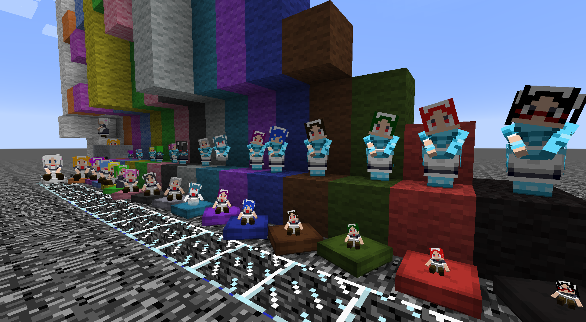

# LittleMaidModel_SizeFor

littleMaidMobにサイズが異なるメイドさんをいっぱい追加します！

基本的には20%~95%までで、5%区切りとなっています。

特殊サイズを除くと16段階 * 16テクスチャ = 256のメイドさんが追加されます。
めちゃんこテクスチャ数が多いので、初回にマルチモデル・テクスチャパック選択画面に移動した瞬間10秒くらいフリーズすることがあります......。

特殊サイズについてはZeroDotPassedBlock, ZeroDot377DangerPassedHalfBlock, ZeroDot333Danger[NotSR2]があります。

# 対応バージョン

Java8以上が必要です(Optionalとラムダ式をコードに使っている関係で理論上はJava7では動きません)
request Java8

現行公式ランチャーならデフォルトがJava8かJava16なので問題ありません。

動作確認済みバージョン(簡易)フォーラムコピペ用

1.7.10、1.10.2、1.12.2peko、1.12.2firis、1.15.2forge、1.16.4forge

推定動作可能: 1.7.10以上のLMM全て(**1.12.2unofficialを除く**)

forgeインストール自体が不可能になったので確かめることができていませんが、1.8.x(NX~LMR)でも動作すると思います。

推定動作不可能: 1.7.10未満、1.12.2unofficial

詳細な動作確認済みバージョン表記

- 1.7.10
    - 1.7.10-Forge10.13.4.1614-1.7.10
    - EBLib-0.1.1.forge1121.jar
    - littleMaidMobX-1.7.x_0.1.3a.jar
- 1.10.2
    - 1.10.2-forge1.10.2-12.18.3.2511
    - [1.9.4-1.10.x]EBLib-6.1.5.8.jar
    - [1.9.4-1.10.x]LittleMaidReengaged-8.1.4.132.jar
- 1.12.2peko
    - 1.12.2-forge-14.23.5.2855
    - [1.12.2]EBLib-6.1.6.9-peko_build.jar
    - [1.12.2]LittleMaidReengaged-8.1.6.141-peko_build-1.1.1.jar
- 1.12.2firis
    - 1.12.2-forge-14.23.5.2855
    - LittleMaidAvatar-1.2.2.jar
    - LittleMaidReengaged_FirisPatch-9.3.7.fp.057.jar
    - LMLibrary-1.1.5.jar
- 1.15.2forge
    - 1.15.2-forge-31.2.50
    - LMML-Forge-1.15.2-1.3.10.jar
    - LMRB-Forge-1.15.2-1.3.5.jar
- 1.16.4forge
    - 1.16.4-forge-35.1.37
    - LMML-Forge-1.16.4-2.3.10.jar
    - LMRB-Forge-1.16.4-2.4.1.jar

# モデルの命名規則について

例: ZeroDot950[Danger][NotSR2][Passed XXX][VerYYY]

[XXX]はモデルによりあったり、なかったりします。

[VerYYY]はリリースバージョン表記です。

Zero Dot 950は拡大率0.95倍(95%)のサイズであることを意味します。 なので基本的に数字の部分だけを見て判断することができます。

DangerつきのメイドさんはLMRFP(LittleMaidReengagedFirisPatch)にて、 ボート窒息が発生することを確認したサイズのメイドさんです。

### Danger (危険)が付いたメイドさんについて

Danger付きのメイドさんはイレギュラーや想定外の動作を起こす可能性が高いため、付与しています。

小さいメイドさんほど窒息やバグ等が発生しやすいと考えてください。

＼バックアップを駆使した上で、十分に注意してご利用くださいませ／

### NotSR2が付いたメイドさんについて

単に翻訳すると「SR2ではない」ですが、NotSR2が付かないメイドさんはSR2が持っている瞬き機能を持っています。

デフォルトのメイドさんはどのバージョンでも瞬きをしなかったと思いますが、個人的にして欲しいので何も付いていない方が瞬き機能を持っています。

でも、瞬きをしないメイドさんVersionも欲しくなるよね！

プレイヤー的にはSR2と同じ機能を有しているという意味であって、Java的にSR2を継承しているという意味ではないです(当然instance of もFalseが帰ってきます)

**例外的に水色メイド(目隠れのメイドさん)、青色メイド、シアンメイド(オバケメイドさん)は瞬き部分のテクスチャを追加していないため、事実上常時NotSR2付きとなっています。**
青色メイドさんは目元のテクスチャが微妙に異なる関係で他のメイドさんと異なり、全く同じ方法を流用できないため、対応保留です。

### Passed XXXが付いたメイドさんについて

Passed XXXが付いているメイドさんはNot SR2の重複を除き2モデルのみです Passed Block(ブロック通過可能)
Passed Half Block(ハーフブロック通過可能)
これらのメイドさんの拡大率(サイズ)はメイドさんの身長から考え、結構ギリギリに設定しています。
~~メイドさんの髪が天井の摩擦熱でえらいこっちゃ~~

つまり、YYYPassed... のYYY以下のモデルは全てブロックやハーフブロックを通過できるということです。

なお1ブロックを通過可能なメイドさんは1マス通路も移動経路として考慮するようですが、ハーフブロックを通過可能なメイドさんはハーフブロックを通過しようとはしません。プレイヤーが介入する必要があります。
なお、ハーフブロックを通過可能なメイドさんは漏れなくDanger付きのため、様々なブロックやエンティティによる窒息等にご注意ください。

### ZeroDot333Dangerについて

~~ビルドしてから気がつきましたが、33.3%ではなく内部的には33.0%でした。~~(ver2で修正済み)

デバッグ時によく使っていた拡大率のため、+-5%区切りではないですが、同梱しています。

# ユーザーライセンス(User Lisence)

日本語

(堅苦しく書いてますが、結局のところMMM氏の規約+条件を満たした問い合わせ禁止云々が付いたのとほとんど変わりません)

> 以下はzipファイル利用者に課すもので、ソースコード利用者やアセット(リソース)使用者とは内容が異なる場合があります。

>- 商用利用は禁止
>- このMODやプログラムを利用したことによって生ずる如何なる損害等も一切責任を取りません
>- このマルチモデル利用者はこのモデル(SizeFor)固有のモデルやモデルの一部に起きる位置ズレに関する修正対応について、"私を除く"LMM開発者・関係者等に問い合わせてはいけません
>   - 憶測でしかないですが、LMM側で対応する場合マルチモデルの構造上、対応に相当な手間がかかることが予想されるためです
>   - 内部的にはクラス、テクスチャ全てサイズ毎に独立しているので、20モデル位の個別同時対応をするようなものではないかと個人的には考えています

English
> The following restrictions apply to users of the zip file, and may be different from those for users of the source code or assets (resources).
> - Commercial use is prohibited.(Don't use it for commercial purposes)
> - I will not be responsible for any damage caused by using this mod or program.
> - Users of this multimodel should not contact LMM(littleMaidMob) developers or other parties (except for me) regarding fixes for misalignment of models or parts of models specific to this model (SizeFor).
>   - (Limited to bugs that are out of position)
>   - I'm just guessing, but it's expected to take a lot of time and effort to deal with this issue on the LMM side due to the structure of the multi-model.
>   - Internally, all classes and textures are independent of each other in size, so I personally think it would be like handling about 20 models simultaneously.

# 注意事項(Attention)

日本語
> - 繰り返しになりますが、このMODやプログラムを利用したことによって生ずる如何なる損害等も一切責任を取りません(お気に入りのメイドさんがボート窒息死したことで生じた、精神的な苦痛といったものも含みます)
>- 利用者は導入前に***必ず***ゲームフォルダのバックアップ等を取ってください

>- 全メイドさんが特殊なサイズのため、ゲームが異常な挙動を起こす可能性があります。
>- 大切なメイドさんが謎のすり抜けを起こして消滅したり、窒息死をしたりしても責任は取れません
>- ゲームバージョンによりますが、Danger付きのメイドさんはボートで窒息死するため、乗り捨てたボート等に十分注意する必要があります
>- もし、ボートや何かしらに乗っているメイドさんが黒っぽくなったら窒息している可能性があるので、直ちにボートを破壊することを推奨します
>- 他Modで追加される乗り物系(ヘリ等)にも十分注意してください(特にDanger付き)

>- 1.7.10においてDanger付きのメイドさんを座布団に座らせることは非推奨です
0.2倍のメイドさんを座らせると"Zabuton"が異常な挙動を起こします
>  - 禁止というわけではないのでやっても構いませんが、メイドさん消失やシャドウブロックの出現といった異常が生じる可能性があります
>    - テストプレイ時には岩盤一枚のみのスーパーフラットで200Dangerのメイドさんを座らせ、インベントリを開いた瞬間プレイヤーが床抜けし、奈落へ落ちました
>
English
> - Again, I will not be held responsible for any damages caused by using this mod or program.
>- Please make sure to backup your game folder before installing the game.

>- Due to the special size of all maids, the game may behave abnormally.
>- We cannot be held responsible if your precious maids mysteriously slip through the cracks and disappear or die of suffocation.
>- Depending on the game version, maids with Danger(ZeroDot200~400Danger) will suffocate to death in boats, so be very careful of abandoned boats, etc.
>- If the maid on the boat or whatever turns black, she may be suffocating, and it is recommended to destroy the boat immediately.
>- Be very careful with vehicles (helicopters, etc.) that are added by other mods (especially with Danger).

 As of 1.7.10, it is deprecated to sit maids with Danger(ZeroDot200~400Danger) on the cushions If you sit a 0.2x maid on the cushions, "Zabuton" will behave abnormally.
>   - It is not forbidden to do so, but it may cause anomalies such as the disappearance of maids and the appearance of shadow blocks.
>      - During test play, I had a ZeroDot200Danger maid sitting on a super flat with only a single rock, and when I opened the inventory, the player fell through the floor and into the abyss.

# マルチモデルJavaソースコードライセンス、　リソースライセンス

***"Multi Model Java Code License" And "Assets License"***

***利用者に課せられる利用条件や禁止行為等と異なる場合があります***

***This may be different from the End User License Agreement.***

マルチモデルJavaソースコードライセンスとは、src/main/java/下にあるModelLittleMaid...から始まるJavaコードに適応されるライセンスのことです。
AutoBuildProject/src/Main.javaには適応されません(ライセンス未定義)

リソースライセンスとはsrc/main/resources/下にあるpngファイル及び、配布zipに含まれるpngファイルに適応されるライセンスのことです。

マルチモデルJavaソースコードライセンス、 リソースライセンスについては以下のライセンスが適応されます。

日本語
> 利用条件 ・テクスチャーを作ってくれた方々に感謝の祈りを捧げてください。

・動画等での使用、改造、転載すきにしてもよいのよ？

・ただし、商用利用は除く。

・あと、いかなる意味でも作者は責任をとりませぬ。

English
> Terms of Use ・Please say a prayer of thanks to the people who made the textures.

You may use, modify, and reprint the textures in videos and other media.

However, commercial use is excluded. (Don't use it for commercial purposes)

The author will not be held responsible in any way.

リバースエンジニアリングや加工配布、移植などご自由にどうぞ。

ただし、やむを得ない理由がない限り、二次配布からモデルを入手するのは推奨しません。

# 更新履歴(Release note)

日本語
> ver2 -> リトルメイドがアイテムを持った時の位置ずれ修正

> バージョン表記なし(ver1) -> リリース

English
> ver2 -> Fixed misalignment when littleMaid is holding an item.

> Version None(ver1) -> Release